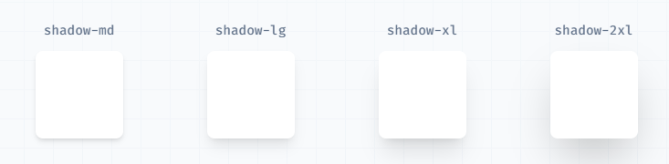

# Tailwind Css

## 화면 크기

- `sm`: 640px 이상의 화면
- `md`: 768px 이상의 화면
- `lg`: 1024px 이상의 화면
- `xl`: 1280px 이상의 화면
- `2xl`: 1536px 이상의 화면

<br>

## Display

- `block` : display: block;
- `inline-block` : display: inline-block;`
- `flex` : display: flex;
- `inline-flex` : display: inline-flex;
- `grid` : display: grid;
- `hidden` : display: none;

<br>

## Overflow

- `overflow-hidden` : overflow: hidden;
- `overflow-scroll` : overflow: scroll;

<br>

## Flex

### Flex Direction

- `flex-row` : flex-direction: row;
- `flex-col` : flex-direction: column;

### Flex Shrink

- `shrink` : flex-shrink: 1;
- `shrink-0` : flex-shrink: 0;

<br>

## Justify Content

- `justify-center` : justify-content: center;
- `justify-between` : justify-content: space-between;
- `justify-start` : justify-content: flex-start;
- `justify-end` : justify-content: flex-end;
- `justify-stretch` : justify-content: stretch;

<br>

## Align Items

- `items-center` : align-items: center;
- `items-start` : align-items: flex-start;
- `items-end` : align-items: flex-end;
- `items-stretch` : align-items: stretch;

<br>

> 가운데 정렬

```html
<div class="flex flex-col justify-center items-center">
  가운데 정렬
</div>
```

<br>

## Margin

- `m-0` : margin: 0px;
- `mx-숫자` : x축 margin 한 번에 설정 (left, right)
- `my-숫자` : y축 margin 한 번에 설정 (top, bottom)

```html
m-0
<!-- margin: 0px; -->
mx-0
<!-- margin-left: 0px; margin-right: 0px; -->
my-0
<!-- margin-top: 0px; margin-bottom: 0px; -->
mt-0
<!-- margin-top: 0px -->
mr-0
<!-- margin-right: 0px -->
mb-0
<!-- margin-bottom: 0px -->
ml-0
<!-- margin-left: 0px -->

mt-2
<!-- margin-top: 0.5rem-->
mt-4
<!-- margin-top: 1rem -->
mt-5
<!-- margin-top: 1.25rem -->
mt-12
<!-- margin-top: 3rem -->
```

<br>

## Padding

- `p-0` : padding: 0px
- `px-숫자` : x축 padding 한 번에 설정(left, right)
- `py-숫자` : y축 padding 한 번에 설정(top, bottom)

**_margin과 쓰는 법 동일!!_**

<br>

## Width, Height

- `w-0` : width: 0px
- `w-px` : width: 1px
- `w-full` : width: 100%
- `w-3/12` : width: 25%
- `w-10/12` : width: 83.333333%;
- `w-screen` : width: 100vw;

- `min-w-0` : min-width: 0px;
- `min-w-4` : min-width: 1rem;
- `min-w-96` : min-width: 24rem;

- `max-w-0` : max-width: 0px;
- `max-w-4` : max-width: 1rem;
- `max-w-96` : max-width: 24rem;

- `h-0` : height: 0px
- `h-px` : height: 1px
- `h-full` : height: 100%
- `h-3/12` : height: 25%
- `h-screen` : height: 100vh;

<br>

## Font Size

- `text-ts`
  - font-size: 0.75rem;
  - line-height: 1rem;
- `text-sm`
  - font-size: 0.875rem;
  - line-height: 1.25rem;
- `text-base`
  - font-size: 1rem;
  - line-height: 1.5rem;
- `text-lg`
  - font-size: 1.125rem;
  - line-height: 1.75rem;
- `text-xl`
  - font-size: 1.25rem;
  - line-height: 1.75rem;
- `text-2xl`
  - font-size: 1.5rem;
  - line-height: 2rem;
- `text-3xl`
  - font-size: 1.875rem;
  - line-height: 2.25rem;
- `text-4xl`
  - font-size: 2.25rem;
  - line-height: 2.5rem;
- `text-5xl`
  - font-size: 3rem;
  - line-height: 1;

<br>

## Text

### Text Align

- `text-center` : text-align: center
- `text-left` : text-align: left
- `text-right` : text-align: right

### Text Color

- `text-[#색상코드]` : 색상코드로 설정
- `text-white` : color: #FFFFFF;
- `text-gray-400` : color: #9ca3af;
- `text-blue-600/숫자` : 투명도를 숫자만큼 설정 (100이 선명, 0이 투명)

커스텀 color 설정  
`text-regal-blue`

```javascript
module.exports = {
  theme: {
    extend: {
      colors: {
        'regal-blue': '#243c5a',
      },
    },
  },
};
```

### Text Decoration

- `no-underline` : text-decoration-line: none

### Whitespace

- `whitespace-nowrap` : 줄바꿈 없애기 white-space : nowrap;

<br>

## Line Height

- `leading-4` : line-height: 1rem
- `leading-5` : line-height: 1.25rem
- `leading-6` : line-height: 1.5rem

<br>

## List Style

- `list-none` : list-style-type: none

<br>

## Background Color

- `bg-black` : background-color: black
- `bg-blue` : background-color: blue

<br>

## Cursor

- `cursor-pointer` : 커서 포인터 표시

<br>

## Border

### Border Radius

- `rounded` : border-radius: 0.25rem
- `rounded-md` : border-radius: 0.375rem (6px)
- `rounded-lg` : border-radius: 0.5rem (8px)
- `rounded-xl` : border-radius: 0.75rem (12px)
- `rounded-2xl` : border-radius: 1rem (16px)
- `rounded-3xl` : border-radius: 1.5rem (24px)

### Border width

- `border-2` : border-width: 2px

### Border Color

- `border-black` : border-color: black
- `border-inherit` : border-color: inherit

### Border Style

- `border-solid` : border-style: solid:
- `border-none` : border-style: none

<br>

## Box Shadow

- `shadow-sm` : box-shadow: 0 1px 2px 0 rgb(0 0 0 / 0.05);
- `shadow` : box-shadow: 0 1px 3px 0 rgb(0 0 0 / 0.1), 0 1px 2px -1px rgb(0 0 0 / 0.1);



<br>

## Transforms

### Scale

- `scale-50` : transform: scale(.5)
- `scale-125` : transform: scale(1.25)

### Rotate

`rotate-*` 사용

- `rotate-1` : transform: rotate(1deg)
- `rotate-45` : transform: rotate(45deg)

### translate

- `translate-x-1` : transform: translateX(0.25rem)
- `translate-y-4` : transform: translateY(1rem)
